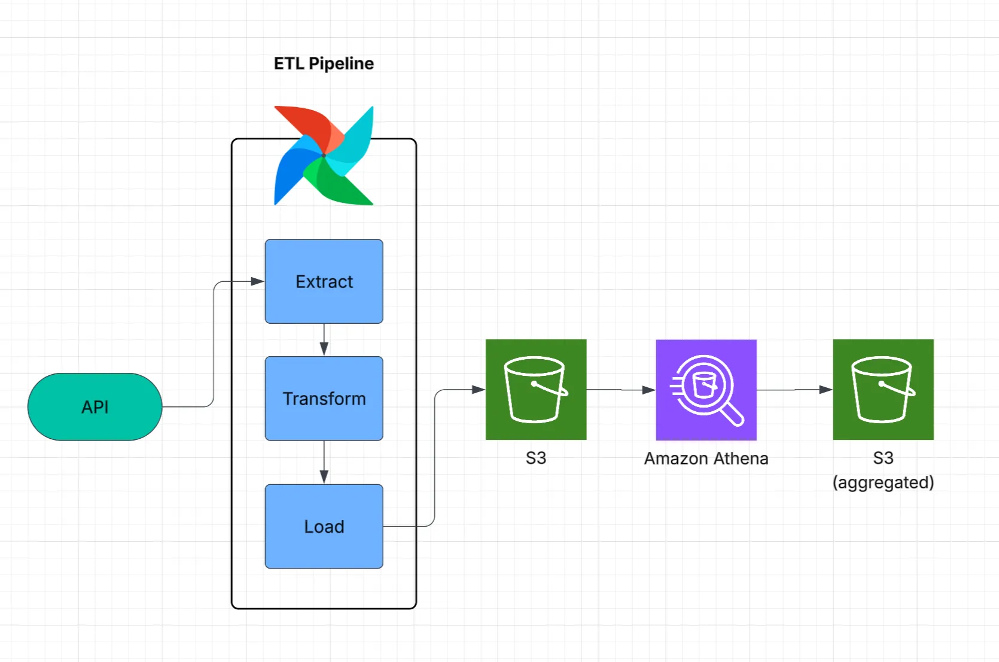
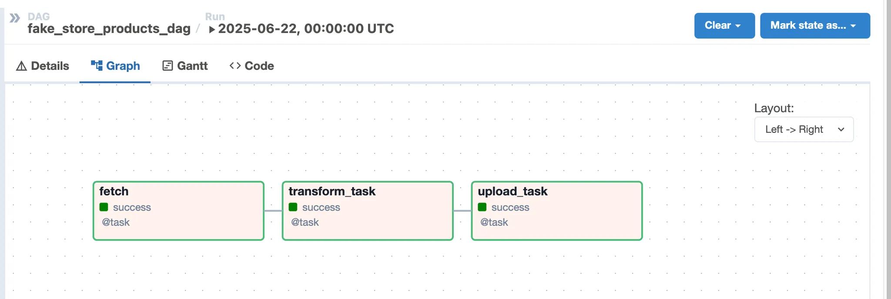
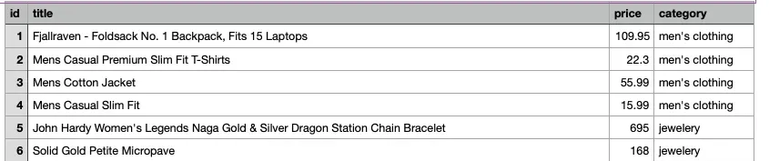
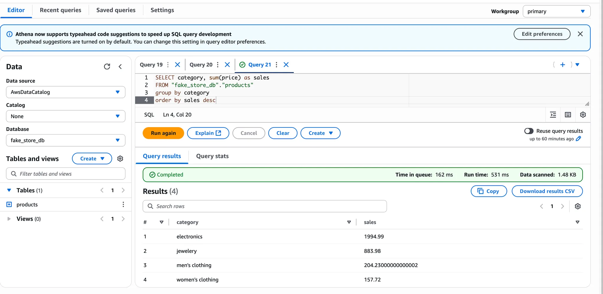

# ETL Pipeline using Apache Airflow, AWS S3, and Athena

## Overview

This project demonstrates a modern,  **ETL pipeline** using **Apache Airflow** to orchestrate tasks for:

- Extracting product data from a public API (Fake Store API)
- Transforming the data into a simplified CSV format
- Storing the transformed data in an **Amazon S3** bucket
- Making the dataset queryable via **AWS Athena** and **AWS Glue Data Catalog**

---

##  Architecture

| Component              | Technology                 |
|------------------------|----------------------------|
| **Data Source**        | [Fake Store API](https://fakestoreapi.com) |
| **Orchestrator**       | Apache Airflow             |
| **Data Lake**          | Amazon S3                  |
| **Query Layer**        | AWS Athena                 |
| **Schema Management**  | AWS Glue Data Catalog      |

---

## ETL Workflow in Airflow

The pipeline is defined in `dag_fetch_products.py` using Airflow's `@task` decorator API.

### Tasks

1. **Extract**  
   - **File**: `fetch_api.py`  
   - **Function**: `fetch_data_from_api()`  
   - **Purpose**: Calls the Fake Store API and stores raw JSON locally

2. **Transform**  
   - **File**: `transform.py`  
   - **Function**: `transform_json_to_csv()`  
   - **Purpose**: Converts raw JSON into a clean CSV with selected fields (`id`, `title`, `price`, `category`)

3. **Load**  
   - **File**: `load.py`  
   - **Function**: `upload_to_s3()`  
   - **Purpose**: Uploads the transformed CSV to an Amazon S3 bucket

It defines the tasks, their execution order, and how data flows between them using XComs.

Then, load the aggregated data into another S3 bucket as a summary dataset.
---

## Sample Output

The cleaned CSV dataset looks like this:

## Querying with AWS Athena

After the transformed CSV is uploaded to S3:

1. Use **AWS Glue Crawler** to catalog the dataset
2. Query the dataset in **AWS Athena** using SQL
3. Perform aggregations and filters
4. Save summary results to another S3 bucket for downstream use

After loading sales data into S3 bucket, query and aggregate data from Athena.

## Further enhancement

Following AWS service will enhance the ELT pipeline and further data analysis:

### 1. **Monitoring with CloudWatch**

- Track Airflow DAG executions, task status, and logs
- Set up log groups for easier debugging

### 2. **Alerting via Amazon SNS**

- Automatically trigger alerts on DAG failures

### 3. **IAM Roles and Fine-Grained Access Control**

- Use **IAM Roles** that ensure least-privilege policies for S3, Glue, and Athena

### 4. **Dashboards with Amazon QuickSight**

- Connect Athena as a data source to build interactive dashboards
- Visualize product trends, pricing insights, and category-wise performance

